# Experiments

## exp1_baseline

**Config:** `training.max_steps=30000 training.batch_size=4 data.val_ids=[4]`

- Default strategy, no app_opt, no bilateral grid, no antialiasing, no absgrad, no random_bkgd
- Random init (100k points, no SfM)
- 28 train images, 1 val image (image 4 — closest to test view 0)

**Results:**

| Metric | Value |
|--------|-------|
| Peak val PSNR | **21.63 dB** (step 7k) |
| Final val PSNR | 20.80 dB (step 30k) |
| Gaussians | 1.18M |
| Training time | 691s (~11.5 min) on H100 |

**Val PSNR curve:**
- Peaks at step 7k (21.63 dB), then slowly degrades to 20.80 dB by 30k — overfitting to training views
- Densification stops at step 15k (default `refine_stop_iter`), Gaussian count stabilizes at ~1.18M

**Test renders (step 7k — peak val PSNR):**

| Test view 0 | Test view 1 |
|-------------|-------------|
| 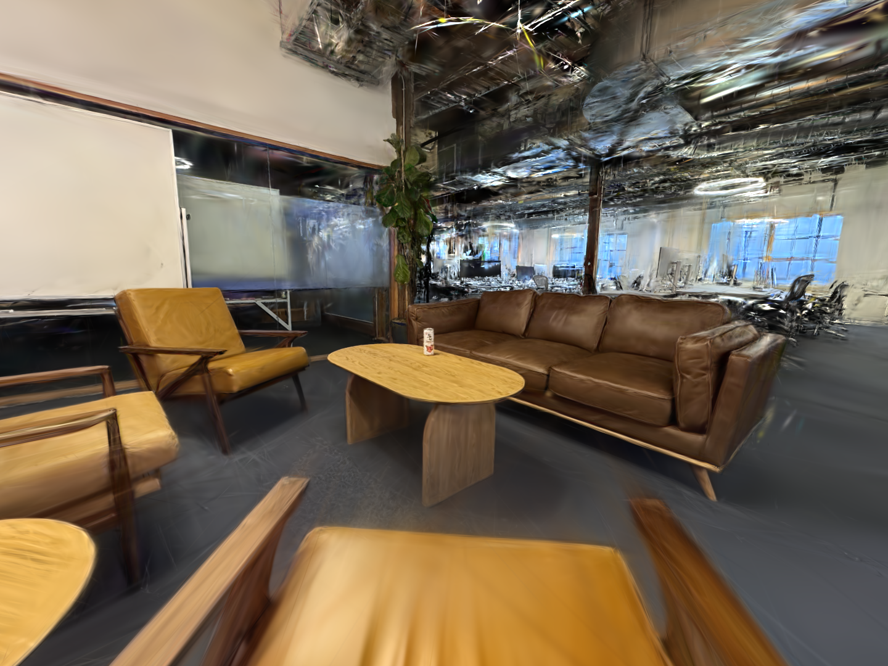 | 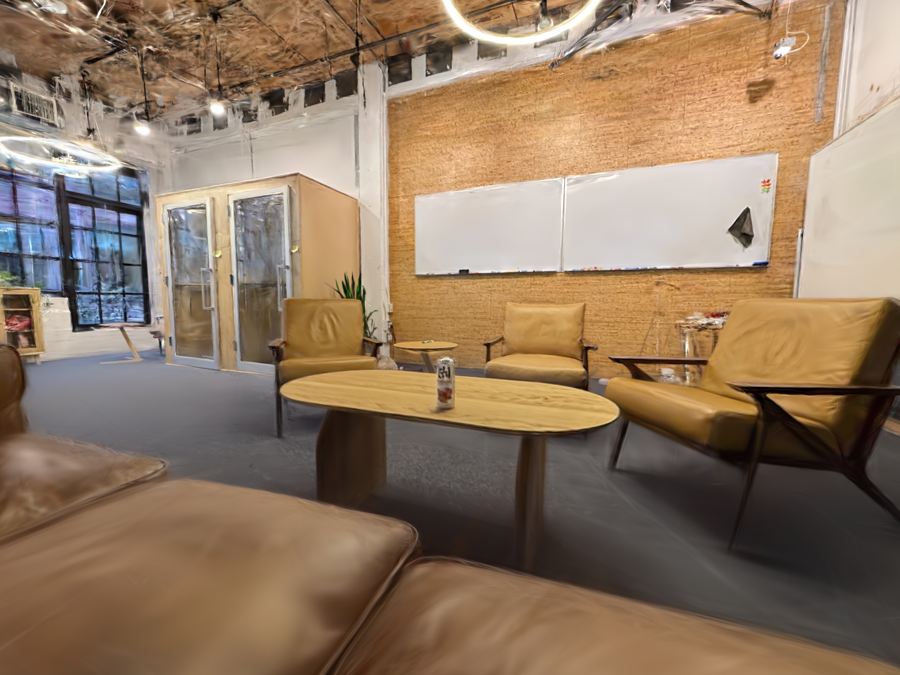 |

**Val render (image 4, step 7k — peak val PSNR):**

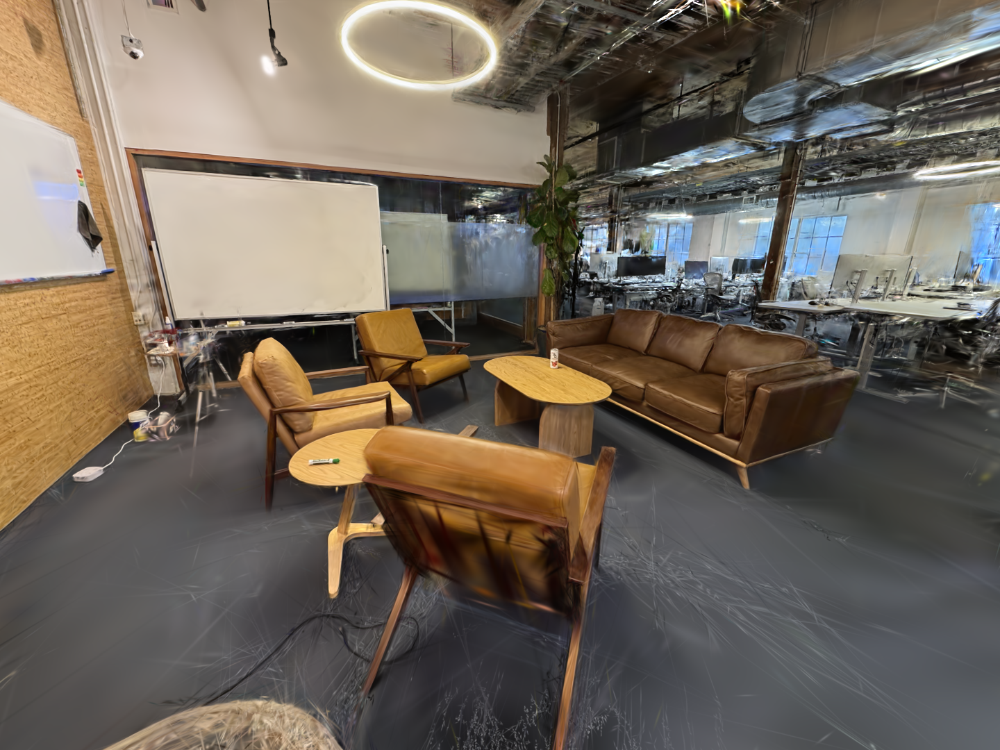

**Observations:**
- Foreground (furniture, walls, whiteboard) is well-reconstructed
- Ceiling/background still has artifacts — consistent with sparse 29-view indoor capture
- Val render (image 4) looks good overall — foreground chair in bottom-right has some smearing at the camera edge
- Model overfits after step 7k — val PSNR drops 0.8 dB over remaining 23k steps while train PSNR keeps climbing

---

## exp2_scale_factor

**Changelog since exp1:**
- Added per-Gaussian `splat_scale_factor` parameter (shape [N, 1], init 1.0, raw space)
- Applied in `Splats.activate()`: `means *= scale_factor`, `scales *= scale_factor`
- LR 2e-3 with exponential decay to 1% (same schedule as means)

**Config:** `training.max_steps=30000 training.batch_size=4 data.val_ids=[4]`

- Same as exp1 baseline but with per-Gaussian scale factor enabled

**Results:**

| | Baseline (exp1) | Scale Factor (exp2) |
|---|---|---|
| Peak val PSNR | **21.63 dB** (step 7k) | 21.45 dB (step 4k) |
| Final val PSNR | **20.80 dB** | 20.58 dB |
| Gaussians | 1.18M | 1.82M |
| Training time | **691s** | 860s |

**Comparison — val PSNR, train PSNR, Gaussian count:**

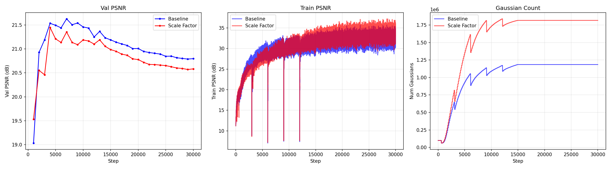

**Test renders (step 4k — peak val PSNR):**

| Test view 0 | Test view 1 |
|-------------|-------------|
| 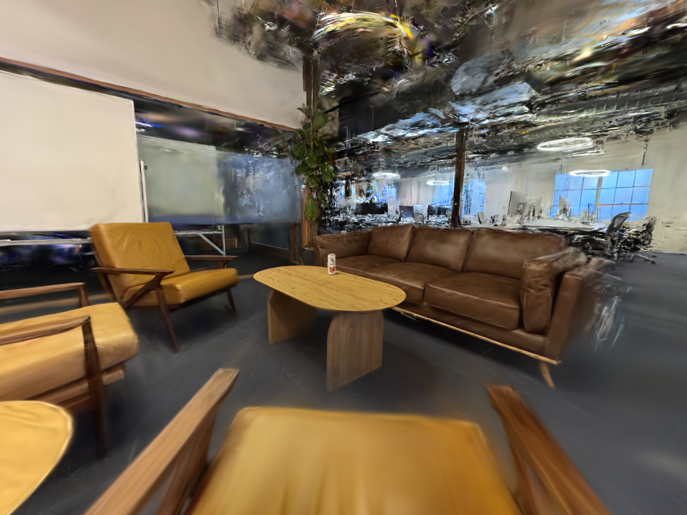 | 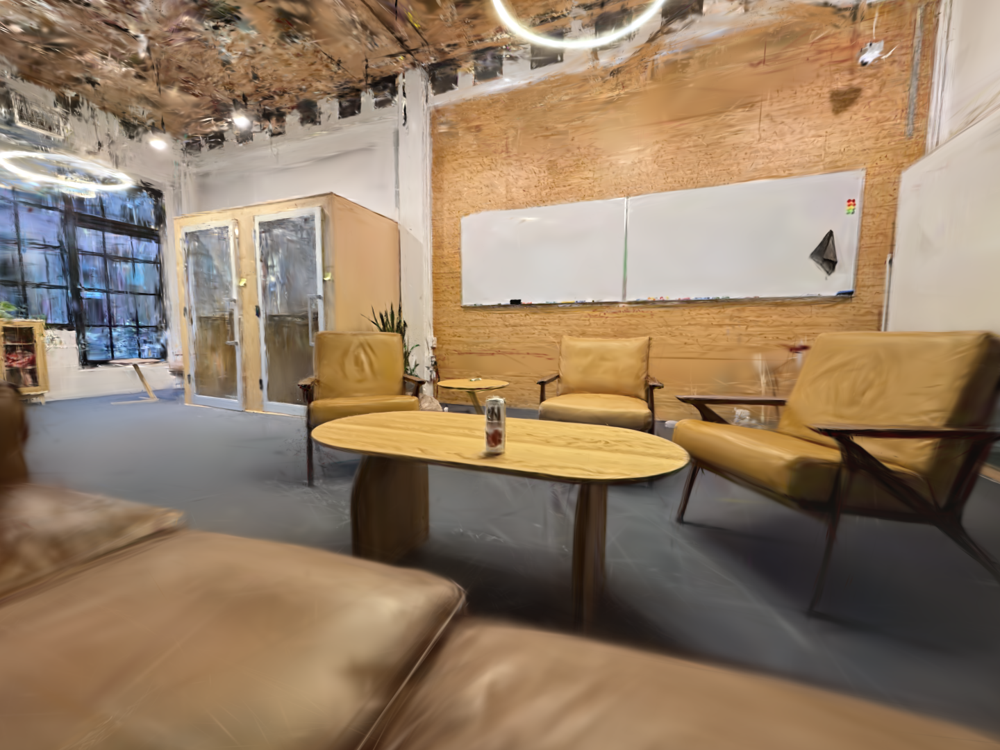 |

**Val render (image 4, step 4k — peak val PSNR):**

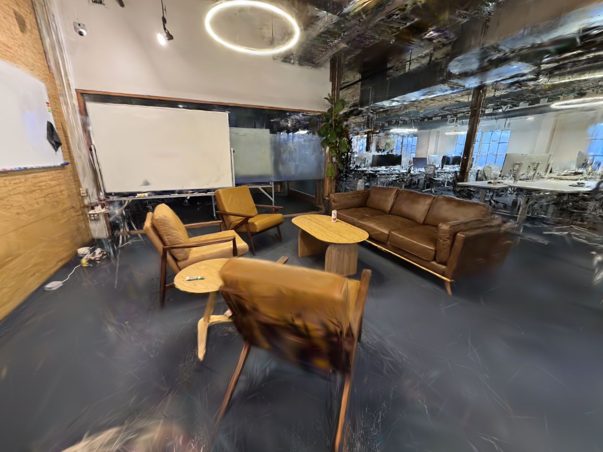

**Observations:**
- Scale factor adds 53% more Gaussians (1.82M vs 1.18M) without improving quality — slight 0.2 dB regression
- Extra parameter gives the strategy more freedom to create Gaussians during densification but they don't contribute useful reconstruction
- Overfitting pattern similar to baseline (peak at 4-7k, gradual decline)
- Test and val renders look comparable to baseline — no visible improvement or degradation
- The additional wall time (860s vs 691s) is from rendering more Gaussians

---

## exp3_full_7k

**Config:** `training.max_steps=7000 training.batch_size=4 data.test_every=0`

- All 29 images used for training (no val holdout)
- 7k steps — corresponds to peak val PSNR step from exp1
- Default strategy, splat_scale_factor off

**Results:**

| Metric | Value |
|--------|-------|
| Gaussians | 777k |
| Training time | 128s (~2 min) on H100 |

**Test renders (step 7k):**

| Test view 0 | Test view 1 |
|-------------|-------------|
| 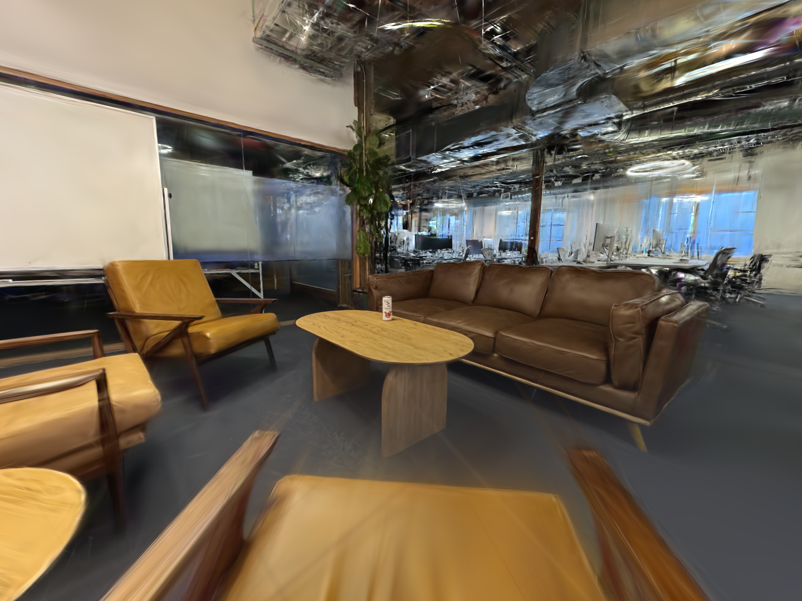 | 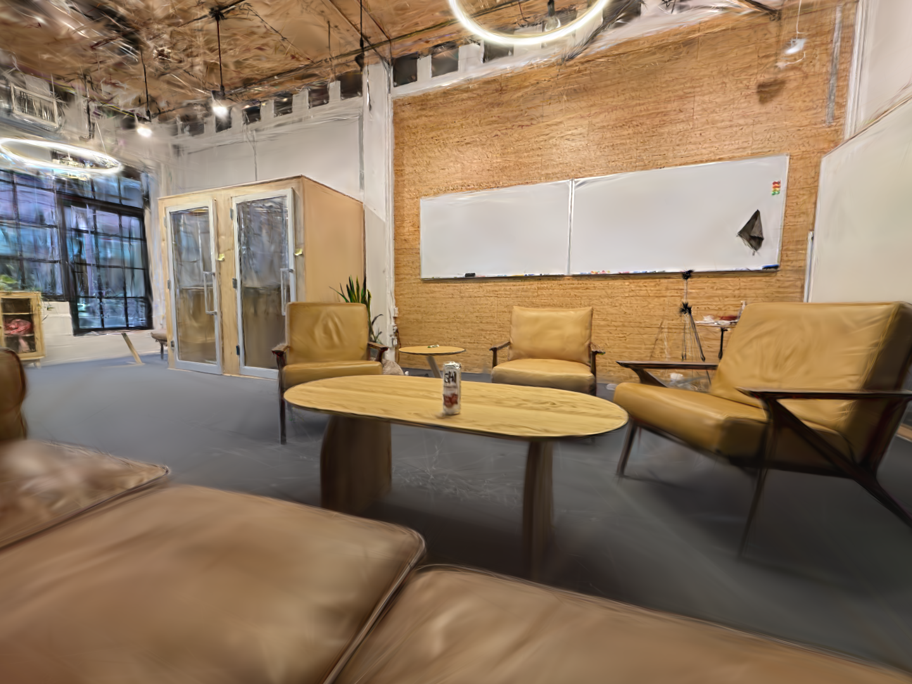 |

**Observations:**
- Best quality renders so far — all 29 views used for training, stopped at sweet spot before overfitting
- Fast training: 128s for the full run

---

## exp4_garden

**Config:** `data_dir=data/garden_capture training.max_steps=30000 training.batch_size=4`

- Mip-NeRF 360 garden dataset (COLMAP format, converted to capture format)
- 185 images at 4x downsample (1297x840), 161 train / 24 val
- Sanity check: standard benchmark to verify our training code works on well-posed data

**Results:**

| Metric | Value |
|--------|-------|
| Peak val PSNR | **26.91 dB** (step 29k) |
| Final val PSNR | 26.89 dB (step 30k) |
| Gaussians | 4.82M |
| Training time | 1504s (~25 min) on H100 |

**Val render (image 0, step 30k):**

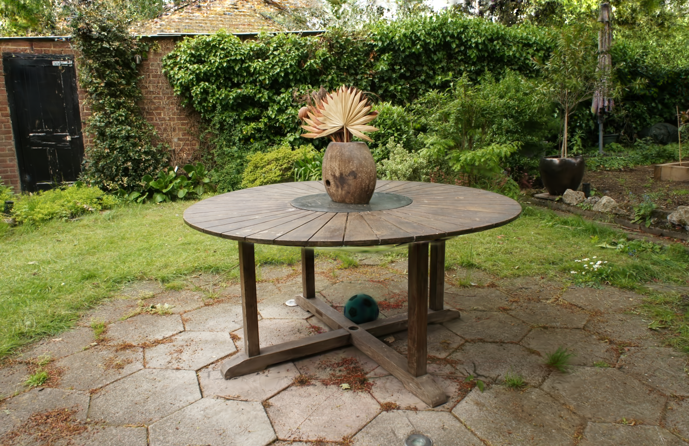

**Auto observations:**
- Val PSNR reaches ~26.9 dB — competitive with published 3DGS results on garden (~27 dB)
- No overfitting — val PSNR keeps improving through 30k steps, unlike our capture dataset
- 4.82M Gaussians (vs 1.18M for capture) — more views support more Gaussians effectively
- Confirms our training code is correct — the quality gap on the capture dataset is from the data (29 sparse views), not a bug

**User observations:**
- No overfitting curve like we see in our capture — validates that the standard training pipeline has no severe bugs
- The capture dataset quality gap is a data problem, not a code problem
- Next steps: determine whether the capture issue is (1) a coverage problem (too few views, sparse angular sampling) or (2) a camera pose accuracy problem (calibration errors in the capture poses)

---

## exp5_garden_28views

**Changelog since exp4:**
- Added `max_train` parameter to CaptureDataset — evenly subsamples training indices

**Config:** `data_dir=data/garden_capture training.max_steps=30000 training.batch_size=4 +data.max_train=28`

- Same garden dataset but subsampled to 28 training views (matching our capture's count)
- Same 24 val views as exp4 for fair comparison
- Tests whether the overfitting is caused by view count alone

**Results:**

| | Garden 161 views (exp4) | Garden 28 views (exp5) | Capture 28 views (exp1) |
|---|---|---|---|
| Peak val PSNR | **26.91 dB** (step 29k) | 20.83 dB (step 7k) | 21.63 dB (step 7k) |
| Final val PSNR | **26.89 dB** | 20.29 dB | 20.80 dB |
| Gaussians | 4.82M | 2.61M | 1.18M |
| Overfits? | No | Yes (after step 7k) | Yes (after step 7k) |

**Comparison vs full garden:**

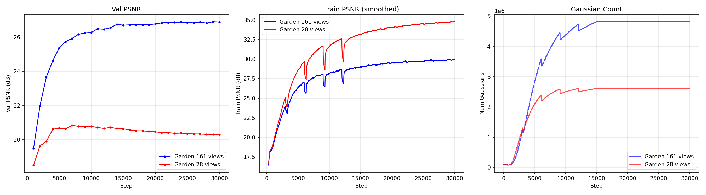

**Val render (image 0, step 7k — peak val PSNR):**

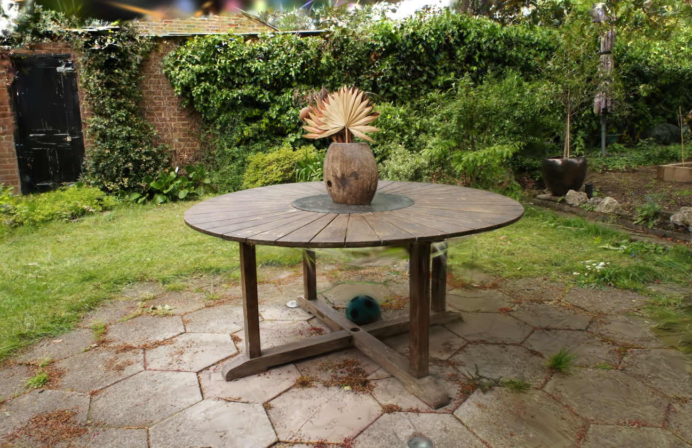

**Auto observations:**
- Overfitting pattern is back — peaks at step 7k then declines, identical timing to our capture dataset
- 6 dB gap between 161 and 28 training views on the same scene
- Confirms the overfitting is a **view count issue**, not specific to our capture data or camera poses
- Peak val PSNR (20.83 dB) is comparable to our capture (21.63 dB) — similar view count → similar quality ceiling
- Garden with 28 views actually scores slightly lower than capture, possibly because garden is a larger/more complex outdoor scene

**User observations:**
- This confirms that the number of views is the primary concern, not camera pose quality
- Camera poses from the capture dataset are sufficiently accurate
- The densification algorithm isn't creating enough splats to cover background details when view count is low — it relies on gradient signal which is weak in under-observed regions
- Next: test whether starting with more initial Gaussians (4x, 8x) helps cover the gaps that densification misses

---

## exp6_init_pts

**Config:** `training.max_steps=15000 training.batch_size=4 data.val_ids=[4] model.init_num_pts={100k,400k,800k}`

- Tests whether more initial random Gaussians improve coverage in under-observed regions
- 15k steps (densification stops at 15k by default)

**Results:**

| Init pts | Peak val PSNR | Peak step | Final (15k) | Gaussians | Time |
|----------|--------------|-----------|-------------|-----------|------|
| **100k** (baseline) | **21.67 dB** | 10k | **21.45 dB** | 1.04M | 311s |
| 400k | 21.23 dB | 13k | 21.10 dB | 1.00M | 330s |
| 800k | 20.67 dB | 10k | 20.54 dB | 1.05M | 357s |

**Comparison — val PSNR, train PSNR, Gaussian count:**

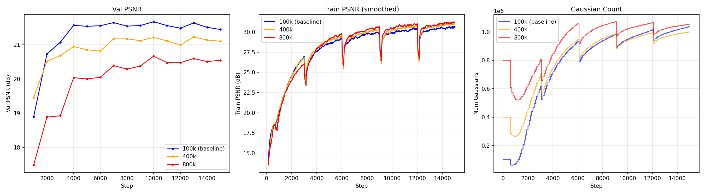

**Auto observations:**
- More initial points is strictly worse — monotonic quality decrease with more init pts
- All runs converge to ~1M Gaussians regardless of starting count — densification/pruning dominates
- Larger init is slower to converge because the initial points are sparser per-Gaussian (same cube, more points = smaller initial scales from KNN)
- The bottleneck is not initial coverage — it's that the densification gradient signal is too weak in under-observed regions regardless of how many points start there

**User observations:**
- Overfitting gets worse with more initial points — keep 100k as default
- The densification algorithm converges to ~1M Gaussians regardless of init count, so starting larger just wastes early training steps
