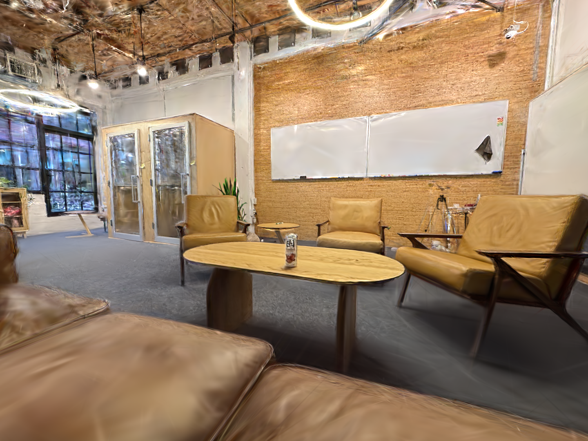
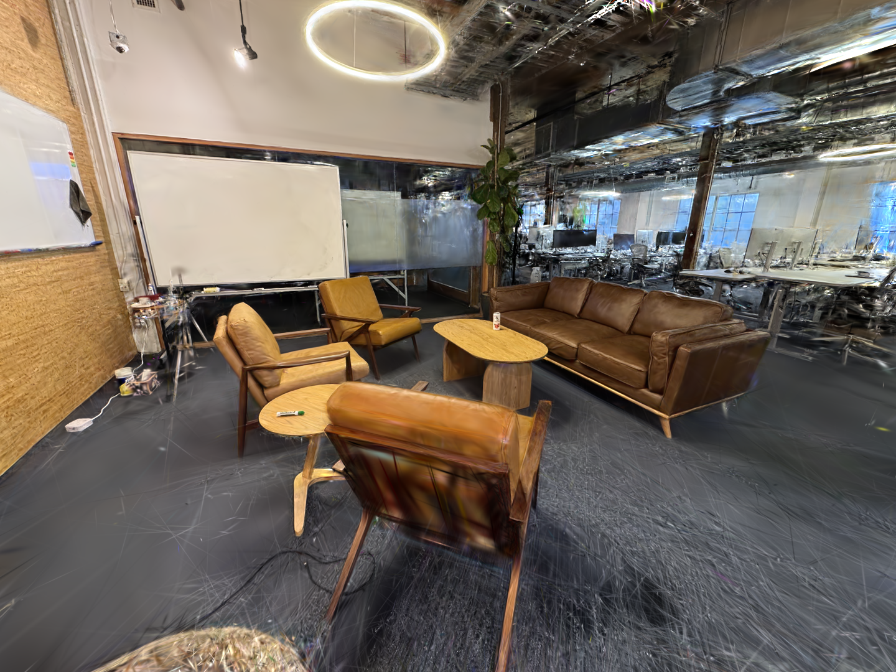
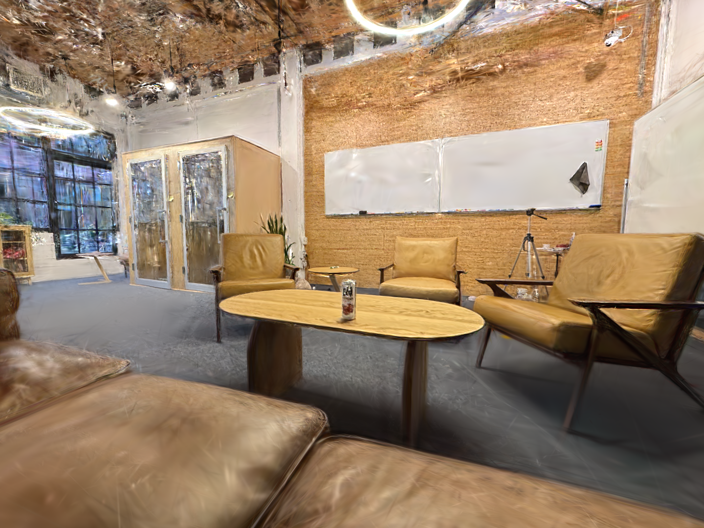
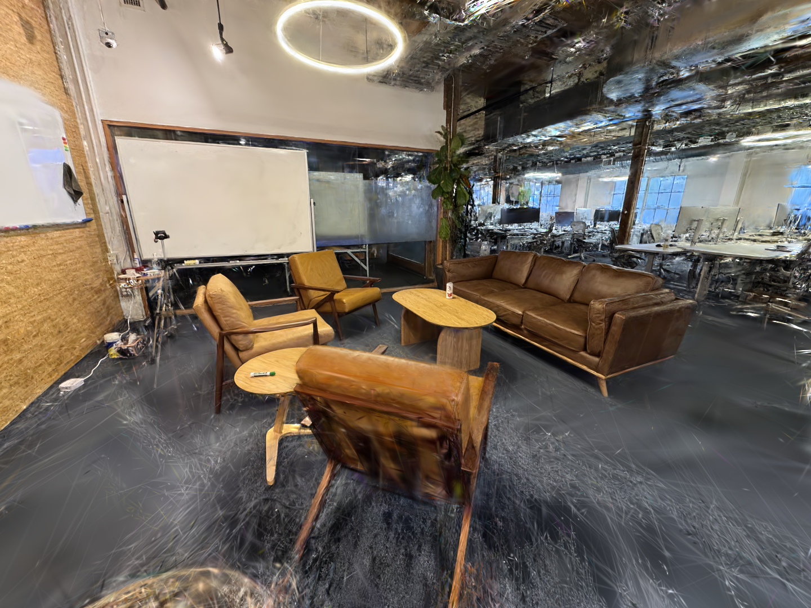

# Experiments

## exp1_baseline

**Config:** `training.max_steps=30000 training.batch_size=4 data.val_ids=[4]`

- Default strategy, no app_opt, no bilateral grid, no antialiasing, no absgrad, no random_bkgd
- Random init (100k points, no SfM)
- 28 train images, 1 val image (image 4 — closest to test view 0)

**Results:**

| Metric | Value |
|--------|-------|
| Peak val PSNR | **21.63 dB** (step 7k) |
| Final val PSNR | 20.80 dB (step 30k) |
| Gaussians | 1.18M |
| Training time | 691s (~11.5 min) on H100 |

**Val PSNR curve:**
- Peaks at step 7k (21.63 dB), then slowly degrades to 20.80 dB by 30k — overfitting to training views
- Densification stops at step 15k (default `refine_stop_iter`), Gaussian count stabilizes at ~1.18M

**Test render (step 30k):**

**Val render (image 4, step 30k):**

**Observations:**
- Foreground (furniture, walls, whiteboard) is well-reconstructed
- Ceiling/background still has artifacts — consistent with sparse 29-view indoor capture
- Val render (image 4) looks good overall — foreground chair in bottom-right has some smearing at the camera edge
- Model overfits after step 7k — val PSNR drops 0.8 dB over remaining 23k steps while train PSNR keeps climbing

---

## exp2_scale_factor

**Changelog since exp1:**
- Added per-Gaussian `splat_scale_factor` parameter (shape [N, 1], init 1.0, raw space)
- Applied in `Splats.activate()`: `means *= scale_factor`, `scales *= scale_factor`
- LR 2e-3 with exponential decay to 1% (same schedule as means)

**Config:** `training.max_steps=30000 training.batch_size=4 data.val_ids=[4]`

- Same as exp1 baseline but with per-Gaussian scale factor enabled

**Results:**

| | Baseline (exp1) | Scale Factor (exp2) |
|---|---|---|
| Peak val PSNR | **21.63 dB** (step 7k) | 21.45 dB (step 4k) |
| Final val PSNR | **20.80 dB** | 20.58 dB |
| Gaussians | 1.18M | 1.82M |
| Training time | **691s** | 860s |

**Comparison — val PSNR, train PSNR, Gaussian count:**

**Test render (step 30k):**

**Val render (image 4, step 30k):**

**Observations:**
- Scale factor adds 53% more Gaussians (1.82M vs 1.18M) without improving quality — slight 0.2 dB regression
- Extra parameter gives the strategy more freedom to create Gaussians during densification but they don't contribute useful reconstruction
- Overfitting pattern similar to baseline (peak at 4-7k, gradual decline)
- Test and val renders look comparable to baseline — no visible improvement or degradation
- The additional wall time (860s vs 691s) is from rendering more Gaussians
